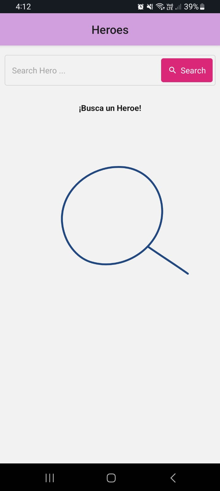
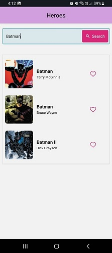
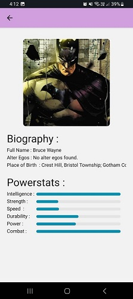

# App Heroe

## Aplicación creada con REACT NATIVE
Aplicación movil creada con react native, consumiendo la documentación SuperHero API.

## Características Principales:
1. **La aplicacion tiene un buscador ,donde se ingresa el nombre del heroe y se presiona el boton para buscar.** 

2. **El buscador nos muestra la lista de heroes que tienen el nombre ingresado.** 

3. **Al seleccionar un heroe se puede ver sus datos personales, las habilidades que tiene como su ciudad como el nombre completo del heroe.**

4. **Si el buscador no encuentra resultados, muestra un mensaje de error.**

